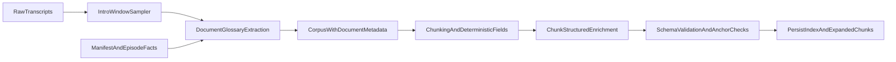

# Transcript Metadata Expansion Plan

## What The 10-Transcript Glossary Changed

Using the current OpenRouter setup from `.env` against a 10-transcript sample, the strongest recurring signals were not generic semantic fields but repeated show-format patterns:

- sponsor / ad-read openings
- cast intros and host mentions
- topic rundown lines near the start of episodes
- holiday / theme framing like Halloween, Juneteenth, St. Patricks
- explicit format pivots such as recap, reaction, prediction, guest interview, season premiere

The weak areas were the ones we expected:

- free-form speaker attribution in unlabeled dialogue
- broad semantic grouping like `topic_category`
- open-world guest detection when the episode does not explicitly label someone as a guest

This means the implementation should be `glossary-first`, not just `schema-first`.

## Core Design Revision

Keep the strict non-null + anchored metadata requirement, but split the metadata system into three tiers.

### Tier 1: Deterministic Intro Metadata

Extract from filename, manifest, and the first intro window of each transcript.
These are the most anchorable and should populate document-level fields early.

Fields strongly supported by the glossary sample:

- `show_title`
- `episode_type`
- `host_names`
- `guest_names` when explicitly introduced
- `episode_date`
- `episode_description`
- `episode_url`
- `url_slug`
- `season`
- `episode_number`
- `holiday_theme`
- `content_type` for intro/ad-read/setup sections
- `topic` and `subtopic` seed values from topic-rundown lines

### Tier 2: Deterministic And Hybrid Chunk Metadata

Derived from chunk position, nearby context, and lightweight matching.

Fields that should be glossary-driven with controlled vocab first:

- `chunk_index`
- `adjacent_context_window`
- `mentioned_people`
- `mentioned_teams`
- `mentioned_leagues`
- `conversation_type`
- `claim_type`
- `content_type`

These should use controlled vocabularies seeded by the glossary examples rather than raw open-text generation.

### Tier 3: LLM-Heavy Inference

Only after tiers 1 and 2 are in place.
These fields still must be populated, but their values should come from constrained schemas rather than free-form text.

Fields:

- `speaker`
- `topic` when chunk-local topic differs from the intro seed
- `subtopic`
- `sentiment`
- `stance`
- `source_confidence`

## Glossary-Driven Controlled Vocabularies

The glossary sample suggests the plan should introduce explicit enums before coding extraction.

### `episode_type`

Start with:

- `season_premiere`
- `recap`
- `reaction`
- `prediction`
- `guest_interview`
- `trade_breakdown`
- `playoff_recap`
- `league_news`

### `content_type`

Start with:

- `ad_read`
- `cold_open_banter`
- `cast_intro`
- `topic_rundown`
- `main_discussion`
- `guest_interview`
- `promo_read`
- `outro`

### `topic_category`

The glossary sample showed this field is weak if it is too open-ended. Make it a constrained taxonomy:

- `team`
- `player`
- `league`
- `event`
- `business`
- `social_justice`
- `show_meta`
- `sponsor`
- `holiday`

### `conversation_type`

- `debate`
- `analysis`
- `reaction`
- `banter`
- `interview`
- `news_roundup`
- `promotion`

### `claim_type`

- `fact`
- `opinion`
- `prediction`
- `rumor`
- `anecdote`
- `promotion`

### `stance`

- `supportive`
- `critical`
- `mixed`
- `skeptical`
- `descriptive`

## Speaker Strategy Revision

The glossary makes it clear that open-world speaker extraction will be brittle. Revise the plan so `speaker` is always selected from an episode roster built in this order:

1. intro/cast-intro mentions in the opening window
2. manifest/document metadata
3. recurring show cast priors
4. current episode guest list

Then the LLM must choose from that closed roster only and provide a rough anchor. This is a stronger plan than letting the model invent a speaker label.

## Anchor Strategy Revision

The glossary also shows that anchors should not all be chunk-local in the same way.

Use two anchor classes:

- `document_anchor`: points to intro/setup text or manifest-derived evidence for episode-wide fields
- `chunk_anchor`: points to local chunk text for discussion-specific fields

Every field still needs an anchor, but the plan should allow inherited document-level anchors for fields like `holiday_theme`, `episode_type`, `host_names`, and `guest_names`.

## OpenRouter Usage Revision

Continue using the current `.env` configuration and let `OPENROUTER_MODEL` choose the model, but the plan should now include two separate structured-output prompts:

1. `document_glossary_extraction`

Runs on intro windows and manifest context to populate deterministic or semi-deterministic document fields.

1. `chunk_enrichment_extraction`

Runs on chunk text plus compact document context to populate chunk fields and their anchors.

Both should use strict JSON schema and closed enums seeded from the glossary above.

## Data Flow Revision

## Additional Work Added To The Plan

1. Add a glossary artifact step before implementation.

Create a tracked metadata glossary/spec for the corpus using 10-20 representative transcripts and keep it as the source of truth for enums and anchor strategies.

1. Add intro-window parsing as a first-class pipeline stage.

The sample shows too much value in the first 1-3 minutes to leave that implicit.

1. Separate document inference from chunk inference.

This reduces repeated LLM work, improves consistency, and makes non-null fields more realistic.

1. Narrow weak fields before implementation.

`topic_category`, `guest_names`, and `speaker` need constrained vocab and review rules instead of fully free extraction.

## Revised Expected Outcome

After implementation and rebuild:

- document-level metadata comes primarily from intro windows and source-backed episode facts
- chunk-level metadata inherits stable document context instead of rediscovering it every time
- every metadata field still has a value and a rough anchor
- the no-unknown rule is preserved, but with better controlled vocabularies and fewer brittle hallucinations
- the plan is grounded in actual transcript structure rather than a generic metadata wish list

